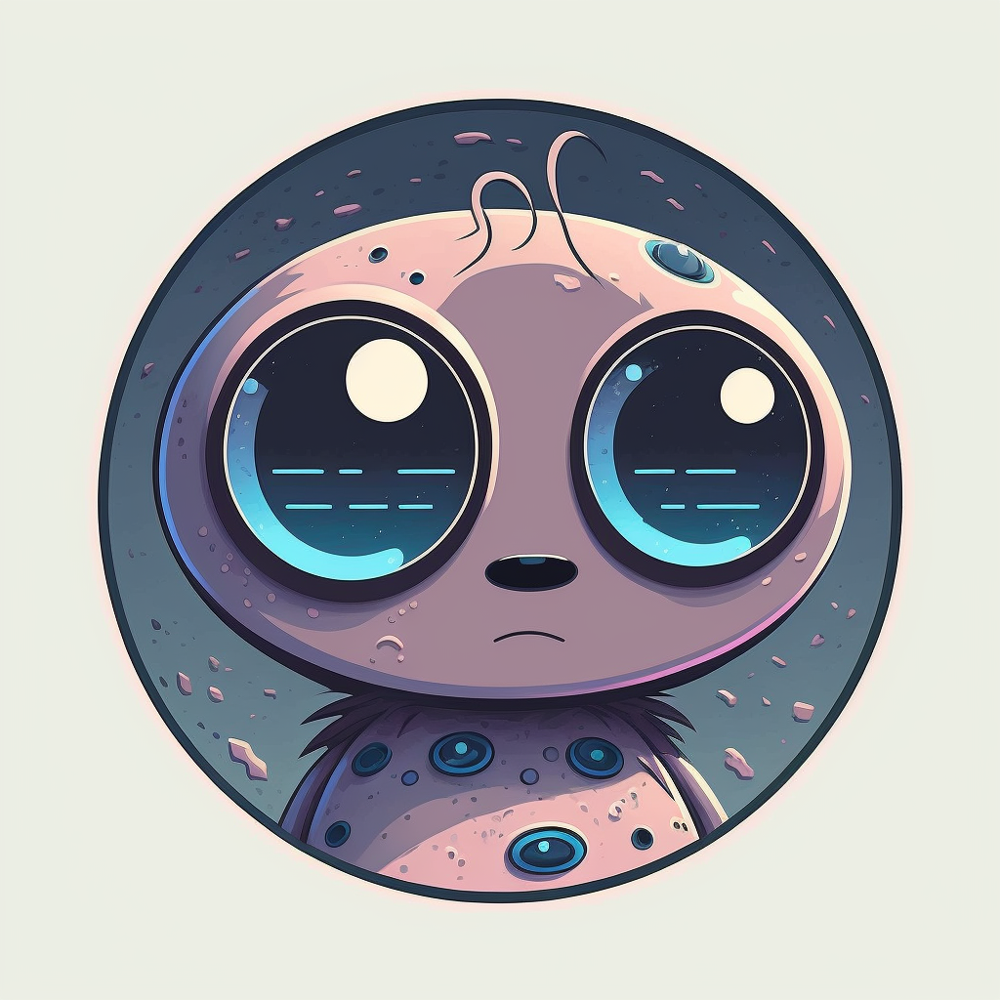

# HelloDiscordBot

A Discord bot in C#.

Using the [mediatR example](https://github.com/discord-net/Discord.Net/tree/dev/samples/MediatRSample/MediatRSample) provided by [Discord.net](https://github.com/discord-net/Discord.Net).

# Getting Started
Here are the steps for [creating a discord bot](https://discordpy.readthedocs.io/en/latest/discord.html).
Be sure to [enable the right bot settings](https://github.com/discord-net/Discord.Net/issues/2470).
Add your bot token to the appsettings.json file. 

An icon was included using mid journey.

